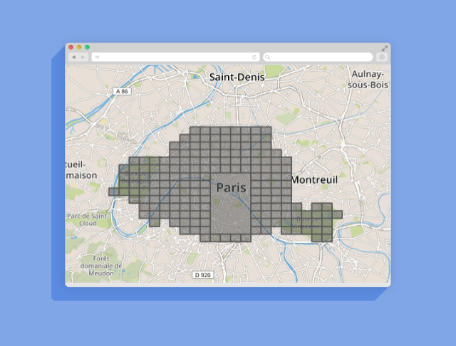

# Geohash'it [](https://travis-ci.org/wmorin/geohashit) [](https://codecov.io/gh/wmorin/geohashit)

Geohash'it is a simple API server to help you get geohashed shapes. It could be countries, cities or whatever geometry you would like in a simplified fashion. It help you create efficient geo index.

For example, starting from a geopoint, you can end up with a geohashed city.



## Installation

```
pip install -r requirements.txt
```

## Launch API server

```
./start
```

Server is now listening for calls on http://127.0.0.1:5000/