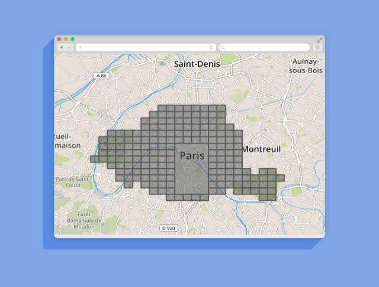

# Geohash'it

[](https://github.com/wmorin/geohashit/actions/workflows/test.yml)

Geohash'it is a small Flask API that turns places or GeoJSON shapes into geohash
coverage polygons. It can resolve a point or city through OpenStreetMap Nominatim,
cover the resulting shape with geohashes, and return either the geohash list or a
GeoJSON MultiPolygon.

For example, starting from a geopoint, you can produce a geohashed city boundary:



## Requirements

- Python 3.13 or 3.14
- `uv`

## Installation

```bash
uv sync --dev
```

## Run The API

```bash
./start
```

The server listens on `http://127.0.0.1:5000/`.

Debug mode is disabled by default. For local development only:

```bash
FLASK_DEBUG=1 ./start
```

For production, run the Flask app behind a WSGI server instead of Flask's built-in
development server.

## Docker

Build and run the production image locally:

```bash
docker build -t geohashit .
docker run --rm -p 5000:5000 geohashit
```

Released images are published to GitHub Container Registry as
`ghcr.io/wmorin/geohashit`.

## API

All responses are JSON. Validation errors return:

```json
{"error": "message"}
```

### `GET /`

Returns service metadata and a list of available API endpoints.

### `GET /health`

Returns `{"status":"ok"}` for uptime checks.

### `GET /multipolygon_from_point`

Returns geohash cells as a GeoJSON polygon collection for the city or country at a
latitude/longitude.

Query parameters:

| Name | Required | Description |
| ---- | -------- | ----------- |
| `lat` | yes | Latitude from `-90` to `90` |
| `lon` | yes | Longitude from `-180` to `180` |
| `type` | yes | `city` or `country` |
| `precision` | yes | Geohash precision from `1` to `8` |
| `simplify` | no | `true`, `false`, `1`, or `0`; defaults to `false` |

Example:

```bash
curl "http://127.0.0.1:5000/multipolygon_from_point?lat=48.8566&lon=2.3522&type=city&precision=5"
```

### `GET /multipolygon_from_city`

Returns geohash cells as a GeoJSON polygon collection for a named city.

Query parameters:

| Name | Required | Description |
| ---- | -------- | ----------- |
| `city_name` | yes | City name to search through Nominatim |
| `country_code` | yes | Two-letter country code |
| `precision` | no | Geohash precision from `1` to `8`; defaults to `5` |

### `GET /multipolygon_from_geohash`

Decodes a geohash to a point, resolves the city containing that point, and returns
geohash cells as a GeoJSON polygon collection.

Query parameters:

| Name | Required | Description |
| ---- | -------- | ----------- |
| `geohash` | yes | Valid geohash |
| `precision` | no | Geohash precision from `1` to `8`; defaults to `5` |

### `POST /geohash_from_geojson`

Returns a list of geohashes covering the submitted GeoJSON shape.

Parameters:

| Name | Required | Description |
| ---- | -------- | ----------- |
| `precision` | no | Geohash precision from `1` to `8`; defaults to `5`. Accepted as a query parameter, form field, or JSON envelope field. |

Body:

Send either a `geojson` form field, a raw GeoJSON JSON body, or a JSON envelope
with `geojson` and optional `precision` fields.

Example:

```bash
curl -X POST "http://127.0.0.1:5000/geohash_from_geojson?precision=5" \
  -F 'geojson={"type":"Point","coordinates":[2.3522,48.8566]}'
```

```bash
curl -X POST "http://127.0.0.1:5000/geohash_from_geojson" \
  -H "Content-Type: application/json" \
  -d '{"type":"Point","coordinates":[2.3522,48.8566]}'
```

### `POST /multipolygon_from_geojson`

Returns the submitted GeoJSON shape's geohash cells as a GeoJSON polygon collection.

Parameters:

| Name | Required | Description |
| ---- | -------- | ----------- |
| `precision` | no | Geohash precision from `1` to `8`; defaults to `5`. Accepted as a query parameter, form field, or JSON envelope field. |

Body:

Send either a `geojson` form field, a raw GeoJSON JSON body, or a JSON envelope
with `geojson` and optional `precision` fields.

## Error Codes

| Status | Meaning |
| ------ | ------- |
| `400` | Invalid request parameter or invalid GeoJSON |
| `404` | Nominatim could not find a matching place polygon, or the route does not exist |
| `405` | The route exists, but the HTTP method is not allowed |
| `413` | Request body is larger than 1 MB |
| `502` | Nominatim failed or returned an invalid upstream response |

## Nominatim

By default, requests go to `https://nominatim.openstreetmap.org` with a project
specific User-Agent. You can override both:

```bash
NOMINATIM_URL="https://your-nominatim.example.com" \
NOMINATIM_USER_AGENT="your-app/1.0 your-email@example.com" \
./start
```

The client caches identical requests in memory and rate-limits outbound Nominatim
requests to one request per second.

## Tests

```bash
uv run pytest
```

See [TESTING.md](TESTING.md) for setup details. GitHub Actions uses `uv` and runs
the suite on Python 3.13 and 3.14.
