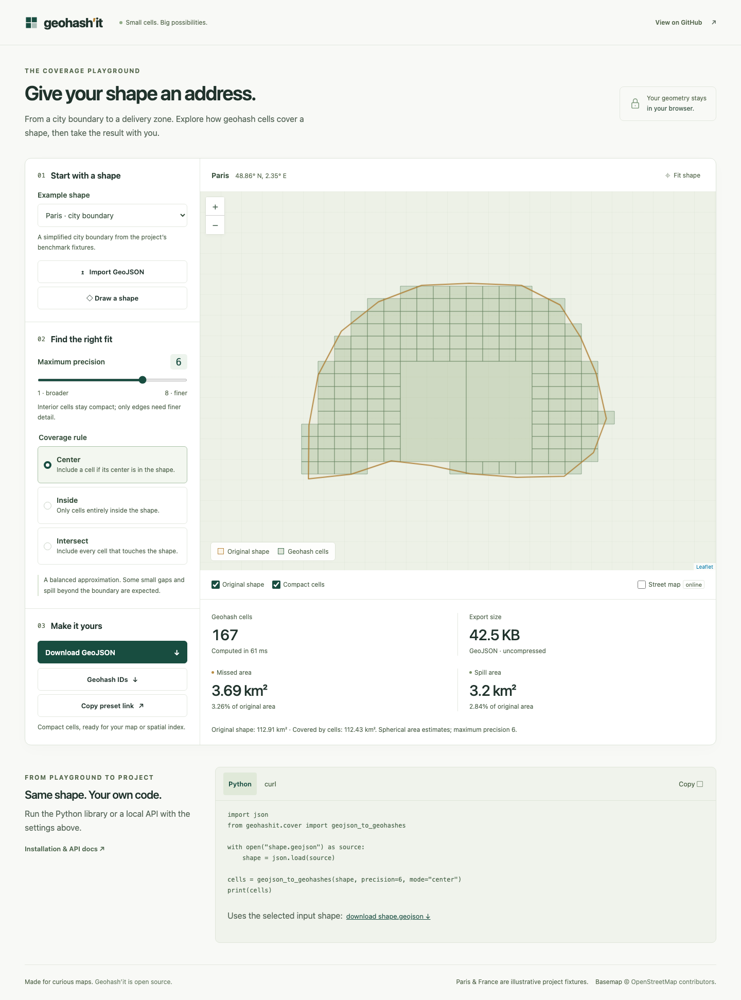
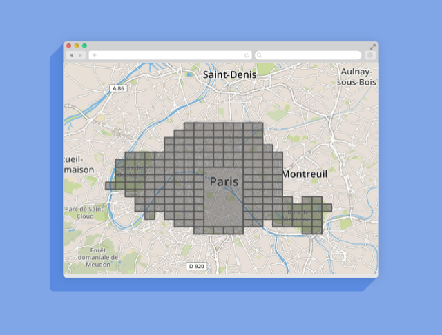

# Geohash'it

[](https://github.com/wmorin/geohashit/actions/workflows/test.yml)

**Turn a region into a compact geohash index. See the accuracy–size tradeoff
before you use it.**

### [Try the coverage playground →](https://wmorin.github.io/geohashit/)

[](https://wmorin.github.io/geohashit/)

Start with Paris, draw a delivery zone, or import a GeoJSON polygon.
Change precision and coverage mode, compare missed area and spill outside the
boundary, then download cell IDs or GeoJSON. No account or server setup needed.
Uploaded shapes are processed locally in your browser; the optional street map
requests tiles from OpenStreetMap when enabled. Preset links can be shared without
uploading any geometry.

Geohash'it also includes a Flask API for pipelines and applications. It can resolve
a point or city through OpenStreetMap Nominatim, cover the shape with geohashes,
and return either the cell IDs or a GeoJSON MultiPolygon.

## Choose your coverage

| Mode | Includes a cell when… | Useful for |
| --- | --- | --- |
| `inside` | The whole cell fits within the shape | Conservative interior coverage; boundary areas may be missed |
| `center` | Its center is inside the shape | A balanced approximation; can both miss and spill |
| `intersect` | It touches or overlaps the shape | Candidate filtering; includes extra area outside the boundary |

Coverings are **compact**: larger cells are retained when fully inside the shape.
Precision is the maximum geohash length, not the length of every returned ID.
When matching fixed-length point hashes, compare their prefixes against the
covering. A plain equality join will miss points covered by shorter IDs. For exact
membership, use intersect coverage to select candidates, then apply an exact
point-in-polygon predicate.

The playground accepts WGS84 Polygon/MultiPolygon GeoJSON (longitude, latitude).
Its area metrics are spherical approximations, not survey measurements. The
Paris and France presets are simplified project benchmark fixtures, and the
delivery zone is synthetic. Use your own authoritative boundary for real work.
Antimeridian-crossing shapes are not supported by the playground.

The demo caps input and normalized shapes at 3,000 positions and output at 20,000
cells. It stops work that exceeds its time or traversal budget. The API permits
10,000 input/normalized positions and 1,000 geometry components, with bounded
collection union work, 100,000 cell visits, and 50,000 output cells. For complex
boundaries, simplify your source geometry or lower the precision.

For example, starting from a geopoint, you can produce a geohashed city boundary:



## Requirements

- Python 3.13 or 3.14
- `uv`

## Installation

```bash
uv sync --dev
```

## Run The API

```bash
./start
```

The server listens on `http://127.0.0.1:5000/`.

Debug mode is disabled by default. For local development only:

```bash
FLASK_DEBUG=1 ./start
```

For production, run the Flask app behind a WSGI server instead of Flask's built-in
development server.

## Docker

Build and run the production image locally:

```bash
docker build -t geohashit .
docker run --rm -p 5000:5000 geohashit
```

Released images are published to GitHub Container Registry as
`ghcr.io/wmorin/geohashit`.

## API

All responses are JSON. Errors return a stable envelope with a machine-readable
code, human-readable message, and HTTP status:

```json
{
  "error": {
    "code": "validation_error",
    "message": "precision must be between 1 and 8",
    "status": 400
  }
}
```

Every coverage endpoint accepts optional `mode=inside`, `mode=center`, or
`mode=intersect`. POST requests also accept `mode` in a form field or JSON envelope;
query parameters take precedence. Explicit modes strictly follow their inclusion
rule and can return no cells. Omitting `mode` preserves the legacy center behavior,
including a representative-cell fallback for tiny shapes.

For example, cover a local polygon without geocoding:

```bash
curl -X POST 'http://127.0.0.1:5000/geohashes/geojson?precision=6&mode=intersect' \
  -H 'Content-Type: application/json' \
  --data-binary @region.geojson
```

### `GET /`

Returns service metadata and a list of available API endpoints.

### `GET /health`

Returns `{"status":"ok"}` for uptime checks.

### `GET /openapi.json`

Returns the OpenAPI 3.2.0 description for the API.

### `GET /multipolygons/point`

Returns geohash cells as a GeoJSON polygon collection for the city or country at a
latitude/longitude.

Query parameters:

| Name | Required | Description |
| ---- | -------- | ----------- |
| `lat` | yes | Latitude from `-90` to `90` |
| `lon` | yes | Longitude from `-180` to `180` |
| `type` | yes | `city` or `country` |
| `precision` | yes | Geohash precision from `1` to `8` |
| `simplify` | no | `true`, `false`, `1`, or `0`; defaults to `false` |

Example:

```bash
curl "http://127.0.0.1:5000/multipolygons/point?lat=48.8566&lon=2.3522&type=city&precision=5"
```

### `GET /multipolygons/city`

Returns geohash cells as a GeoJSON polygon collection for a named city.

Query parameters:

| Name | Required | Description |
| ---- | -------- | ----------- |
| `city_name` | yes | City name to search through Nominatim |
| `country_code` | yes | Two-letter country code |
| `precision` | no | Geohash precision from `1` to `8`; defaults to `5` |

### `GET /multipolygons/geohash`

Decodes a geohash to a point, resolves the city containing that point, and returns
geohash cells as a GeoJSON polygon collection.

Query parameters:

| Name | Required | Description |
| ---- | -------- | ----------- |
| `geohash` | yes | Valid geohash |
| `precision` | no | Geohash precision from `1` to `8`; defaults to `5` |

### `POST /geohashes/geojson`

Returns a list of geohashes covering the submitted GeoJSON shape.

Parameters:

| Name | Required | Description |
| ---- | -------- | ----------- |
| `precision` | no | Geohash precision from `1` to `8`; defaults to `5`. Accepted as a query parameter, form field, or JSON envelope field. |

Body:

Send either a `geojson` form field, a raw GeoJSON JSON body, or a JSON envelope
with `geojson` and optional `precision` fields.

Coverage requests are capped at 50,000 returned geohashes. Very large shapes at
high precision return `validation_error` instead of tying up the server with an
oversized response.

Example:

```bash
curl -X POST "http://127.0.0.1:5000/geohashes/geojson?precision=5" \
  -F 'geojson={"type":"Point","coordinates":[2.3522,48.8566]}'
```

```bash
curl -X POST "http://127.0.0.1:5000/geohashes/geojson" \
  -H "Content-Type: application/json" \
  -d '{"type":"Point","coordinates":[2.3522,48.8566]}'
```

### `POST /multipolygons/geojson`

Returns the submitted GeoJSON shape's geohash cells as a GeoJSON polygon collection.

Parameters:

| Name | Required | Description |
| ---- | -------- | ----------- |
| `precision` | no | Geohash precision from `1` to `8`; defaults to `5`. Accepted as a query parameter, form field, or JSON envelope field. |

Body:

Send either a `geojson` form field, a raw GeoJSON JSON body, or a JSON envelope
with `geojson` and optional `precision` fields.

Coverage requests are capped at 50,000 returned geohashes before the multipolygon
is built.

## Error Codes

Error response `code` values:

| Code | Status | Meaning |
| ---- | ------ | ------- |
| `validation_error` | `400` | Invalid request parameter or invalid GeoJSON |
| `place_not_found` | `404` | Nominatim could not find a matching place polygon |
| `not_found` | `404` | The route does not exist |
| `method_not_allowed` | `405` | The route exists, but the HTTP method is not allowed |
| `payload_too_large` | `413` | Request body is larger than 1 MB |
| `upstream_error` | `502` | Nominatim failed or returned an invalid upstream response |

HTTP status meanings:

| Status | Meaning |
| ------ | ------- |
| `400` | Invalid request parameter or invalid GeoJSON |
| `404` | Nominatim could not find a matching place polygon, or the route does not exist |
| `405` | The route exists, but the HTTP method is not allowed |
| `413` | Request body is larger than 1 MB |
| `502` | Nominatim failed or returned an invalid upstream response |

## Nominatim

By default, requests go to `https://nominatim.openstreetmap.org` with a project
specific User-Agent. You can override both:

```bash
NOMINATIM_URL="https://your-nominatim.example.com" \
NOMINATIM_USER_AGENT="your-app/1.0 your-email@example.com" \
./start
```

The client caches identical requests in memory for up to one hour, capped at 512
entries per process, and rate-limits outbound Nominatim requests to one request
per second.

## Tests

```bash
uv run pytest
```

See [TESTING.md](TESTING.md) for setup details. GitHub Actions uses `uv` and runs
the suite on Python 3.13 and 3.14.

## Benchmarks

Run the geohash coverage benchmark against checked-in city-sized and
country-sized GeoJSON fixtures:

```bash
uv run python benchmarks/benchmark_cover.py
```

Use JSON output for trend collection:

```bash
uv run python benchmarks/benchmark_cover.py --json
```

## Playground development

The demo is a static site in `docs/`, ready for GitHub Pages. Its geometry
worker runs locally in the browser; the Flask API is not required to use the demo.

To publish after merging, enable GitHub Pages for the repository using the
`master` branch and `/docs` folder. The `.nojekyll` file keeps the site static.

```bash
python3 -m http.server 8080 --directory docs
```

Open `http://localhost:8080/`. See [TESTING.md](TESTING.md) for browser-engine tests
and API regression checks.

## License

MIT. Bundled browser dependencies retain their own license notices in
`docs/vendor/`.
